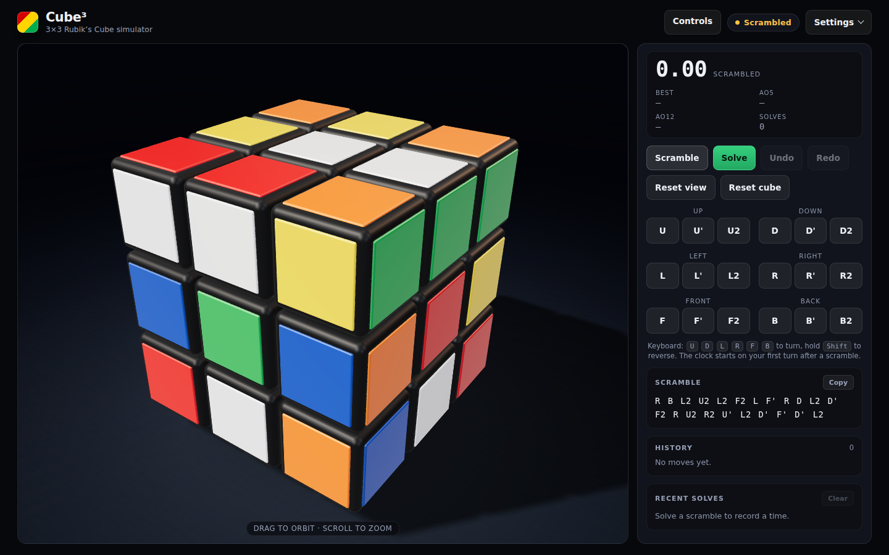

<div align="center">

# Cube³

**A 3×3 Rubik's Cube simulator that runs entirely in your browser.**

I built this as a hobby project to learn three.js, and because I like the cube
a bit too much. The maths is exact integer logic (no floating point drift, ever),
and the rendering is just a picture of that maths. Drag the stickers to turn
faces and middle slices like a real cube, scramble it, and race the clock.

[](https://garvit-pandia.github.io/cube/)

[](https://garvit-pandia.github.io/cube/)

</div>

---

## What it can do

| Feature | Details |
|---|---|
| Drag to turn | Grab any sticker and drag it in the direction you want it to go. Outer layers turn that face; the middle row or column turns the `M`/`E`/`S` slice. Drag the background to orbit, scroll to zoom. Works with touch too. |
| Buttons and keyboard | Full `U D L R F B` panel plus `M E S` slices, each with `X`, `X'`, `X2` variants. Keys: hold `Shift` to reverse, press twice for a half turn. |
| Two ways to solve | **Replay** undoes your moves in reverse. **Optimal solve** computes a near-optimal solution for the cube as it is right now, from any state. |
| WCA-style scrambles | Random-state scrambles, not just random moves. |
| Timer and sessions | Wall-clock timer that starts on your first turn, with best time, Ao5, Ao12 and recent solves saved between visits. |
| Undo and redo | Undo inverses animate through the same queue as everything else. |
| Responsive and accessible | Works on phones, respects reduced motion, and announces solves to screen readers. |

## Solve modes

| Mode | What it does | When to use it |
|---|---|---|
| Replay | Replays your session's turn log in reverse, cancelling and combining moves as it goes. | You just want the cube back the way it was. |
| Optimal solve | Reads the cube's exact state and runs a two-phase search for a short solution, usually 17 to 20 moves. Always available, even after a reload. | You want to see a short solution, or the state came from somewhere else. |

Auto-solve is never recorded as a solve: the clock freezes, the history stays
empty, and you can cancel it mid-animation.

## Quick start

```bash
npm install
npm run dev      # http://localhost:5179/
```

| Command | Effect |
|---|---|
| `npm run dev` | Dev server on port 5179 |
| `npm run test` | Unit tests (159, all pure logic) |
| `npm run test:e2e` | Browser tests with Playwright (11) |
| `npm run build` | Type-check and build to `dist/` |
| `npm run lint` | oxlint |
| `npm run preview` | Serve the built `dist/` |

## How it works

The short version: the cube is a maths model, and the pretty 3D view is a
mirror of it. The meshes never lie to the model, and the model never asks the
meshes for the truth.

- **The state is integers.** Every cubelet has an integer position in `{-1,0,1}³`
  and an integer 3×3 rotation matrix. Moves are matrix multiplies, so a million
  turns cannot accumulate drift. Solved means every face shows one uniform
  colour, which is subtly different from "back to the start".
- **Rendering is a projection.** A turn animates by temporarily overriding
  mesh transforms. When it finishes, the interpolated floats are thrown away
  and exact state-derived transforms are written back.
- **Auto-solve is just bookkeeping.** Replay inverts the turn log. Optimal
  serialises the state to a 54-character facelet string and hands it to the
  solver, then plays the result through the same animation queue.
- **Drag-to-turn is geometry.** A sticker drag is projected onto the face
  plane, cross-producted with the face normal to find the rotation axis and
  layer (an outer layer turns that face, the middle one turns `M`/`E`/`S`),
  and then queued exactly like a button press. There is one input path, not
  two.

## Credits

The optimal solver is a vendored copy of
[min2phase.js](https://github.com/cs0x7f/min2phase.js) by Chen Shuang,
used under the MIT license. It implements Herbert Kociemba's two-phase
algorithm and is the same engine that powers csTimer. Everything else is mine:
built with React 19, TypeScript, three.js, Vite and Vitest, with tests from
Playwright. No backend, no database, no tracking; it is a static bundle.

## Status

This started as a learning project and grew into something I actually use.
Done so far: the exact engine, drag-to-turn, both solve modes, WCA-style
scrambles, timer and session stats. Next up when I get around to it: proper
inspection and penalties for the timer, shareable cube states in the URL, and
maybe an algorithm trainer. Ideas and bug reports welcome via issues.
