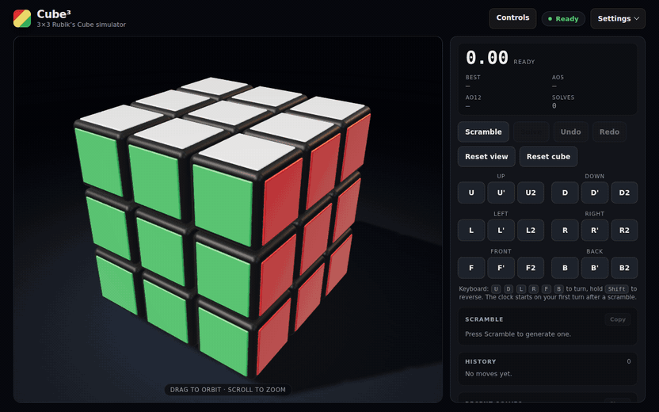
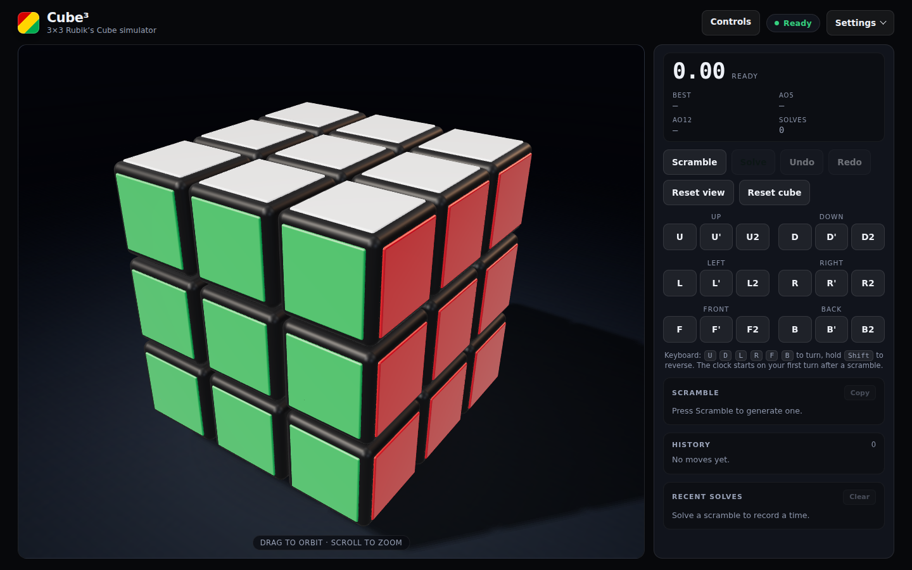
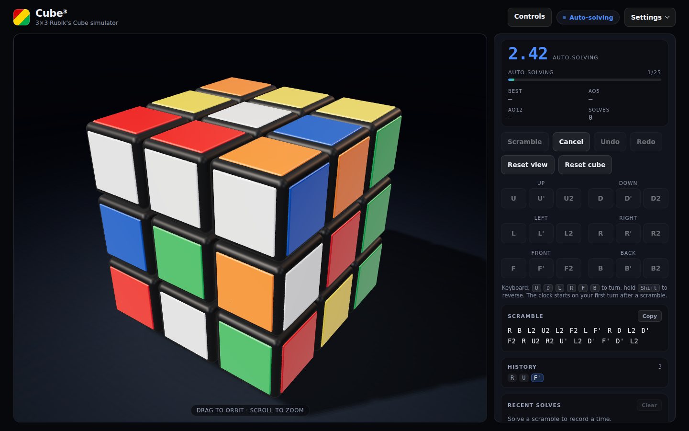
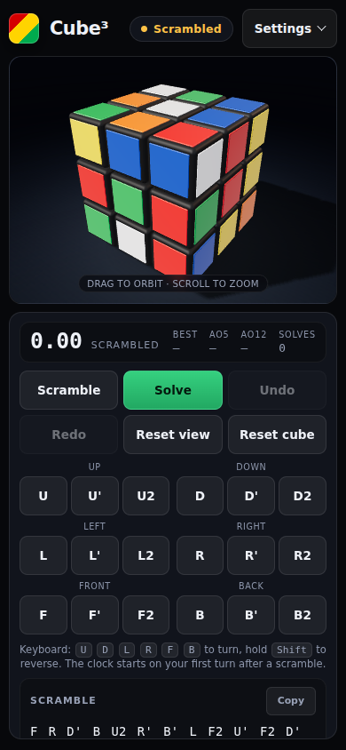

<div align="center">

# Cube³

**A 3×3 Rubik's Cube simulator where the maths — not the mesh — decides the truth.**

An exact integer cube engine driving a polished three.js presenter.
Drag to orbit, turn with keys or buttons, race the clock.

[](https://garvit-pandia.github.io/cube/)

[](#quality)
[](#tech-stack)
[](#tech-stack)
[](#tech-stack)
[](#tech-stack)

[](https://garvit-pandia.github.io/cube/)

<sub>Scrambled state, ready to solve · **[try it live](https://garvit-pandia.github.io/cube/)**</sub>

</div>

---

## Demo

<p align="center">
  
  <br />
  <sub>Scramble → auto-solve, captured from the dev build · smoother <a href="docs/demo/demo.mp4">MP4 version</a></sub>
</p>

## Features

- **Every move, any state** — a full `U U' U2` button panel per face, plus keyboard `U` `D` `L` `R` `F` `B` (hold `Shift` to reverse, press twice for a half turn).
- **Scramble worth solving** — 22-move generator with an axis-alternation rule, so no two consecutive moves fight over the same layer. The clock starts on your first turn after a scramble.
- **Auto-solve from anywhere** — *Solve* replays the session's turn log in reverse through the same animation queue, from a scramble or a hundred random turns. It cancels cleanly and is never recorded as a solve.
- **Undo / redo** — undo inverses animate through the queue; redo restores the path until you turn again.
- **WCA-style sessions** — best time, Ao5, Ao12 and recent solves, persisted across reloads.
- **Exact by construction** — integer positions and rotation matrices; 600-turn stress runs through the real animation queue show zero drift against the logical state.
- **Responsive and accessible** — five breakpoints, ≥44 px mobile tap targets, a screen-reader announcement for solves, and full reduced-motion support.
- **Collapsible controls sidebar** on desktop; the stacked layout stays on mobile.

## Screenshots

| Solved | Auto-solve in progress |
| :---: | :---: |
|  |  |

<p align="center">
  
  <br />
  <sub>Mobile keeps the cube front and centre with the stacked move panel below.</sub>
</p>

## Quick start

```bash
npm install
npm run dev      # http://localhost:5179/
```

| Command | Effect |
|---|---|
| `npm run dev` | Vite on `http://localhost:5179/` — `strictPort`, fails fast on collision |
| `npm run test` | `vitest run` — 106 tests across 5 pure-logic suites |
| `npm run build` | `tsc -b && vite build` → `dist/` |
| `npm run lint` | `oxlint` |
| `npm run preview` | serve the built `dist/` |

## Keyboard

| Keys | Action |
|---|---|
| `U` `D` `L` `R` `F` `B` | clockwise quarter turn of that face |
| `Shift` + key | counter-clockwise turn |
| key twice | half turn |

## How it works

The cube is not animated geometry pretending to be a puzzle — it is an integer model that gets rendered.

- **Authoritative state** (`src/cube/CubeState.ts`) is 27 cubelets, each with an integer position in `{-1,0,1}³` and an integer 3×3 rotation matrix. Moves are integer matrix multiplies, so repeated turns can never accumulate floating-point drift. Solved = every face one uniform colour by logical placement — a centre may be spun.
- **Rendering is a pure projection** of that state (`src/render/*`, the only three.js consumer). A turn animates by *overriding* mesh transforms; when it finishes the interpolated floats are discarded and exact state-derived transforms are written back.
- **Auto-solve is turn-log inversion.** Every turn that lands is appended to an internal log; *Solve* replays `simplifyMoves(invertMoves(log))` through the same queue — correct from any session state, cancellable, and played without touching the history, the session stats or the clock.
- **One-directional architecture.** `src/cube` and `src/session` are pure logic with no DOM/React/three imports; `src/render` only reads cube types and palette; `CubeController` is the single module that bridges all three.

Move convention: a turn clockwise as seen from outside a face is a −90° right-hand rotation about that face's outward normal, using the standard Western colour scheme (white up, green front, red right).

## Tech stack

React 19 · TypeScript 6 (`strict`, no `enum`) · three.js 0.180 · Vite 8 · Vitest 5 · oxlint. No backend, no database, no `.env` — the whole app is a static bundle.

## Quality

All seven phases are complete and green: `npm run test` (106 tests, 5 suites), `npm run build`, and `npm run lint`.

- **Zero drift under load** — 600 turns driven through the real animation queue left `maxPositionError = 0` and `maxQuaternionError = 0` against the logical state.
- **The timer is wall-clock** (`performance.now()`), never summed frame deltas — a dropped frame cannot make a solve read short.
- **Rendering is never authoritative** — verified by comparing every cubelet's rendered transform to the integer state after long runs.
- **Browser-verified interaction** — scramble → solve and random-moves → solve both end solved; cancel mid-solve restores the prior phase; auto-solve leaves history and session stats untouched; layout measured at 1440×900, 1000×600 and 390×844 with no overflow.

| Phase | Scope | State |
|-------|-------|-------|
| 1 | Visual demo — 27 cubelets, rounded bodies, studio lighting, soft shadow, orbit/zoom/touch, reset view | done |
| 2 | Real mechanics — integer cube state, all 18 moves, layer animation + queue, validation suite | done |
| 3 | Full interaction — keyboard, move panel, scramble, reset, history, undo/redo | done |
| 4 | Timer and solve experience — solved detection, wall-clock timer, sessions, WCA Ao5/Ao12 | done |
| 5 | Polish — responsive (5 breakpoints), accessibility, settings, persistence | done |
| 6 | Final validation — browser E2E, 600-move drift/queue stress, camera + touch checks | done |
| 7 | Auto-solve + desktop sidebar — Solve/Cancel with turn-log inversion, collapsible controls panel, `simplifyMoves` test suite | done |

Deliberately **not** implemented (optional in the brief): sound effects, fullscreen, themes, tutorial, algorithm trainer, shareable cube states — and an optimal search solver: *Solve* reverses the moves this session applied rather than searching for a shortest solution.

Architecture invariants and their rationale are documented in [`AGENTS.md`](./AGENTS.md).
